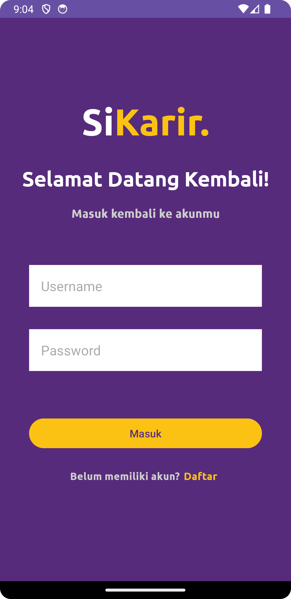

# SiKarir Android Application

## Introduction 👋

SiKarir is an innovative mobile app designed to assist final-year high school students in confidently navigating their future careers and educational paths. Motivated by the uncertainty students often face, SiKarir provides a comprehensive solution to help them make informed decisions about their future.

## Getting Started 📤
1. **Android Device**: Make sure you have an Android phone.
2. **Download the App**: [Download SiKarir here](your-download-link) and install it on your device.
3. **Internet Connection**: Ensure you have an active internet connection to fully experience all features of the app.

## Features 📱

- **Authentication**: Allows users to create an account (sign up), log in to the app, and log out. This ensures that only authenticated users can access certain features of the application.
- **Career Recommendation**:  Displays a list of career recommendations based on the user's quiz results, powered by a machine learning model.
- **Quiz**: Users can take a quiz, which serves as input for the machine learning model to generate personalized career suggestions.
- **Explore Careers**: Users can search for careers and view detailed information about each career.
- **Explore Majors**: Users can search for college majors, view details about each major, and discover top universities offering those majors.
- **Dark Mode**: Supports dark mode for a comfortable viewing experience in low-light environments.
- **Localization**: Supports both Indonesian and English languages.

## Preview Application 👏
| Auth | Home | Major |
| --- | --- | --- |
|  |  |  |

| Career | Quiz | Setting |
| --- | --- | --- |
|  |  |  |

## Run Application Locally 💻
1. **Install Android Studio**
2. **Clone this project using this command in your Terminal**
```bash
git clone https://github.com/SiKarir/mobile-sikarir.git
```
3. **Run the application in your local machine**